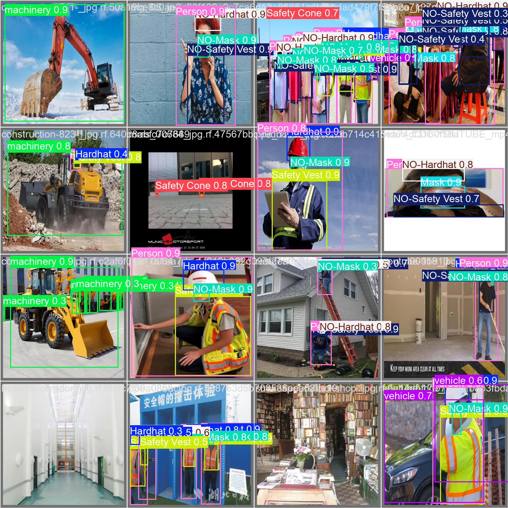
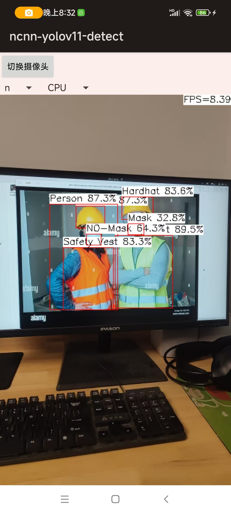
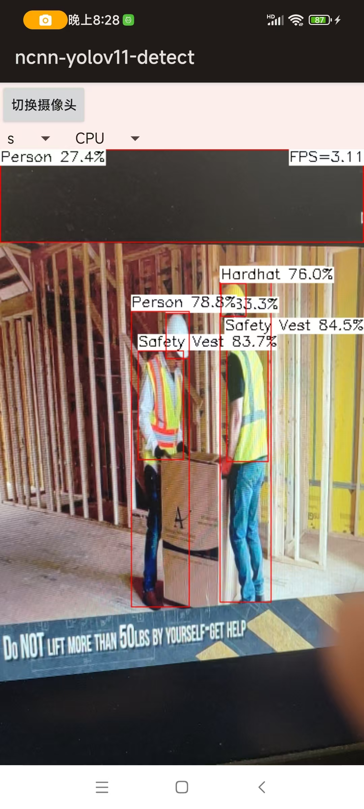

# YOLO11-ncnn-Android

数据集下载：
https://www.kaggle.com/datasets/snehilsanyal/construction-site-safety-image-dataset-roboflow/  
数据集下载到本地后，相应修改ultralytics/SafetyCheck.yaml内容，指定数据集所在路径。  
  
训练：  
```python
cd ultralytics
python train.py
```
  
训练完成后，验证效果如下：  
  
  
转换成ncnn模型：  
```python
./yolo export model=runs/detect/train/weights/best.pt format=ncnn
```
  
Android程序环境：  
```python
NDK: 25.1.8937393
Build Tools Version: 30.0.3
Compile SDK Version: 24
```
  
Android下运行效果如下：  
  
  
  
Reference：  
https://www.bilibili.com/video/BV1Sw411v7nR/?vd_source=536c6319bb75f658a685eb4d2d38d1aa  
https://github.com/gaoxumustwin/ncnn-android-yolov11  
https://docs.ultralytics.com/integrations/ncnn/  
https://github.com/PIPIKAI/android-ncnn-yolo11  
