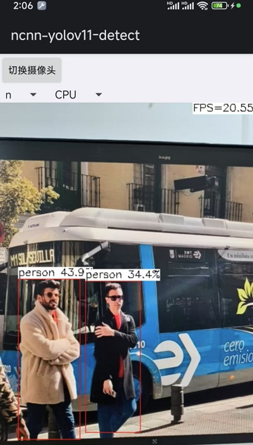

# ncnn-android-yolov11

The YOLOV11 object detection Android demo currently has a frame rate of around 20 frames per second

This is a sample ncnn android project, it depends on ncnn library and opencv

https://github.com/Tencent/ncnn

https://github.com/nihui/opencv-mobile

## optimization

- Network architecture only `Backbone` + `Neck`
- FP16 reasoning

There was a problem with changing the activation function to RELU, which identified a large number of error detection boxes. However, I still believe that changing the activation function to RELU is the correct approach. I will verify where the problem lies when I have time later

## Detailed Tutorial

I have uploaded the detailed tutorial of this project on CSDN, with the link provided：https://blog.csdn.net/gaoxukkk888/article/details/144135343?spm=1001.2014.3001.5502

Currently, n models have been trained, so there is a lack of s models in the warehouse

## how to build and run
### step1
https://github.com/Tencent/ncnn/releases

* Download ncnn-YYYYMMDD-android-vulkan.zip or build ncnn for android yourself
* Extract ncnn-YYYYMMDD-android-vulkan.zip into **app/src/main/jni** and change the **ncnn_DIR** path to yours in **app/src/main/jni/CMakeLists.txt**

### step2
https://github.com/nihui/opencv-mobile

* Download opencv-mobile-XYZ-android.zip
* Extract opencv-mobile-XYZ-android.zip into **app/src/main/jni** and change the **OpenCV_DIR** path to yours in **app/src/main/jni/CMakeLists.txt**

### step3
* Open this project with Android Studio, build it and enjoy!

## some notes
* Android ndk camera is used for best efficiency
* Crash may happen on very old devices for lacking HAL3 camera interface
* All models are manually modified to accept dynamic input shape
* Most small models run slower on GPU than on CPU, this is common
* FPS may be lower in dark environment because of longer camera exposure time

## screenshot

**Note:The poor detection performance on the image is due to the fact that I only trained this model for 5 epochs. Since using 3090 to train 1 epoch takes 15 minutes, I will first export a model for 5 epochs to see the speed effect. Later, I will update the model weights for 50 epochs and 100 epochs**

# reference

https://github.com/gaoxumustwin/ncnn-android-yolov8-pose

https://github.com/zhouweigogogo/yolo11-ncnn

https://github.com/triple-Mu/ncnn-examples/blob/main/cpp/yolov8/src/triplemu-yolov8.cpp

https://zhuanlan.zhihu.com/p/769076635

https://blog.csdn.net/u012863603/article/details/142977809?ops_request_misc=&request_id=&biz_id=102&utm_term=yolov11%E7%9A%84%E8%BE%93%E5%87%BA%E6%98%AF%E4%BB%80%E4%B9%88&utm_medium=distribute.pc_search_result.none-task-blog-2~all~sobaiduweb~default-1-142977809.142^v100^pc_search_result_base2&spm=1018.2226.3001.4187
